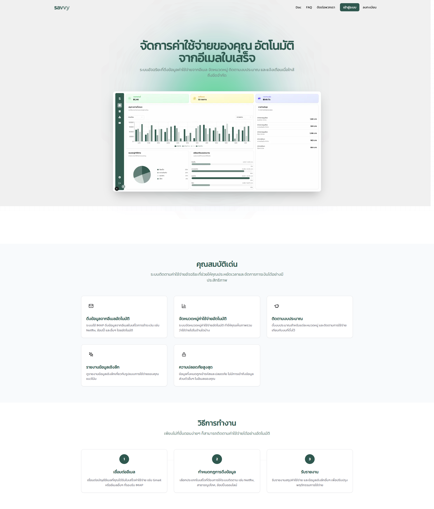
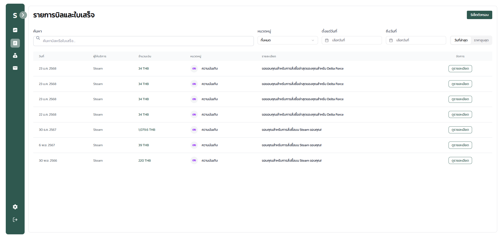
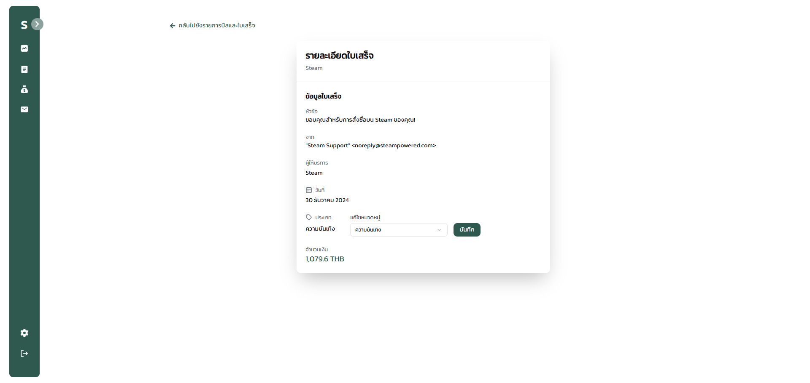
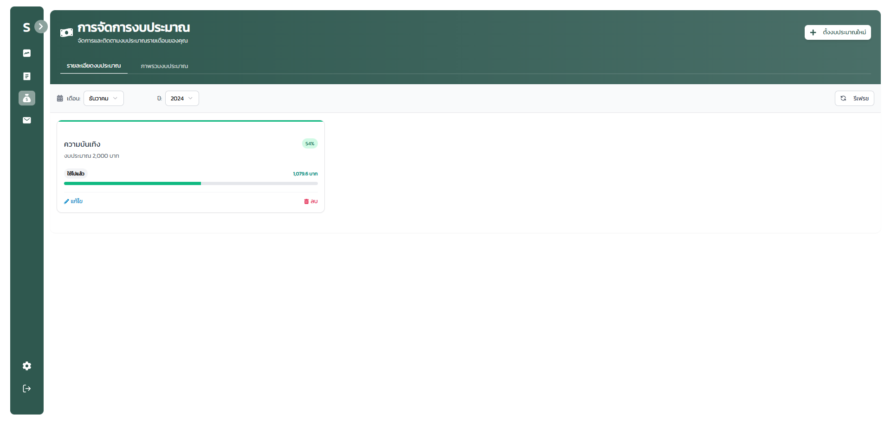
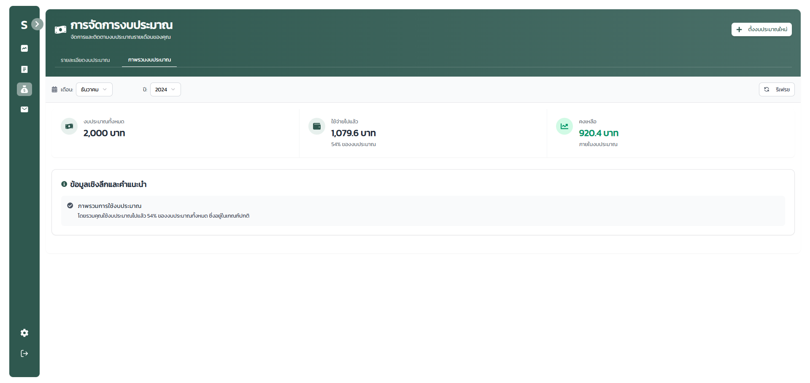
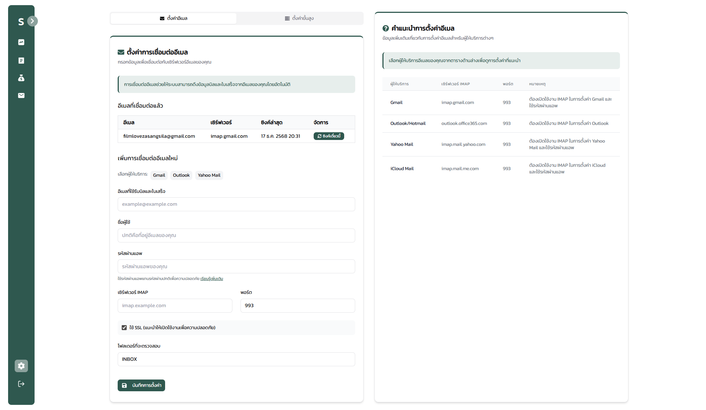
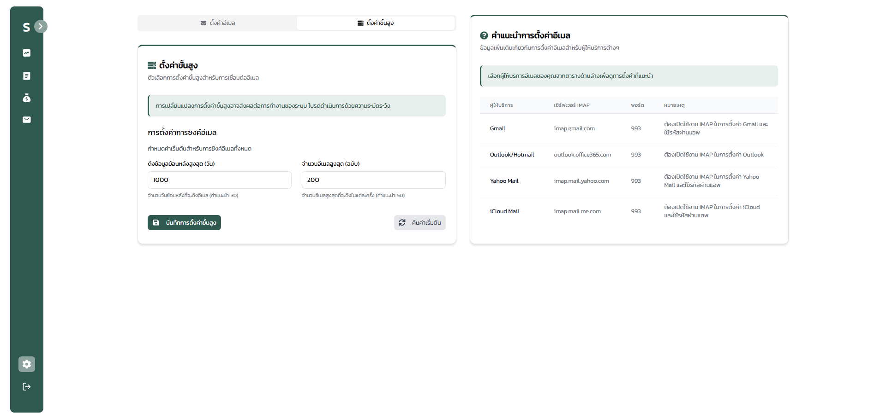

# Savvy Project (Savvy-Front & IMAP-Network)

This project is a full-stack web application for email receipt management and expense tracking, consisting of a Backend (FastAPI) and a Frontend (Next.js).
The system allows users to configure their IMAP email accounts, automatically fetch receipt emails, extract key information (such as vendor, amount, and date), store the data in a database, and present expense analytics and budget management through a web interface.
The backend handles authentication, receipt processing, IMAP synchronization, analytics, and budget management, while the frontend provides dashboards, receipt views, and interactive expense analysis for users.
(System-oriented full-stack web application project)

## Backend 
https://github.com/annop07/IMAP-Network.git

## Screenshots

### First Pages

### Main Dashboard

### Recipet List

### Recipet Detail

### Manage Money

### Manage Overview

### Imap Setting

### Imap Advance Setting

